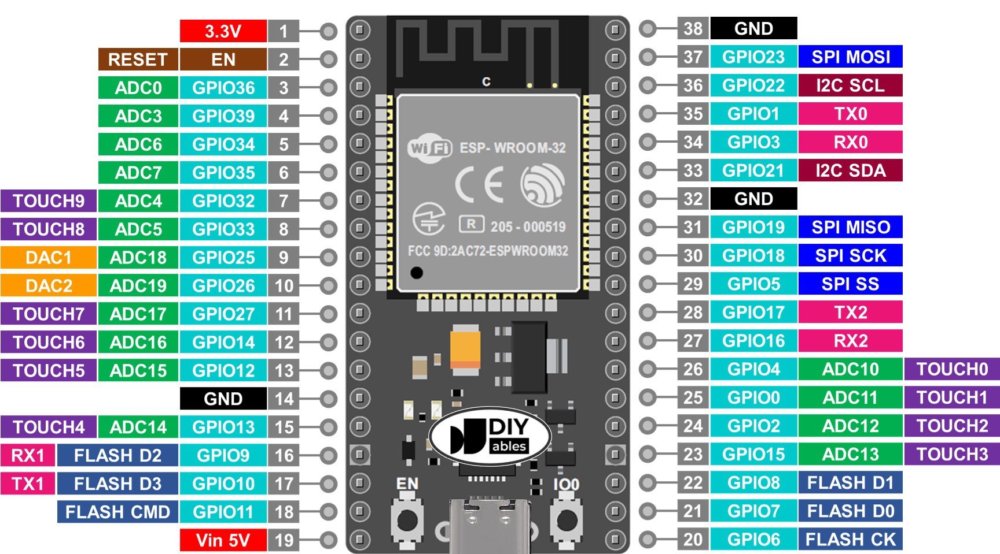
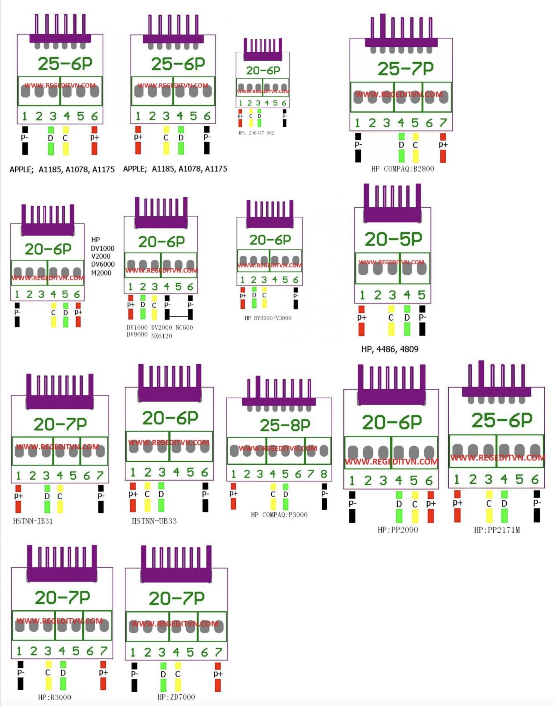
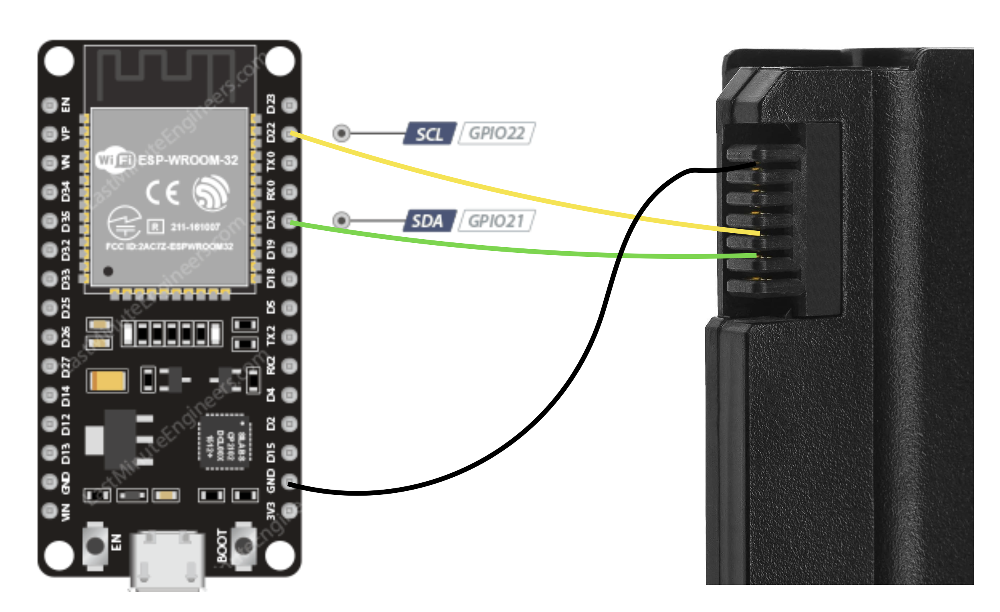
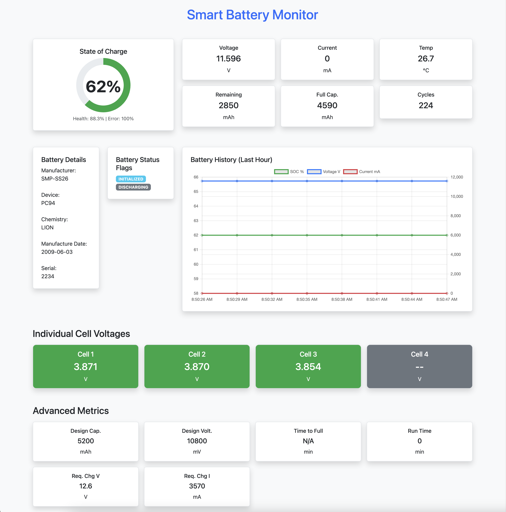
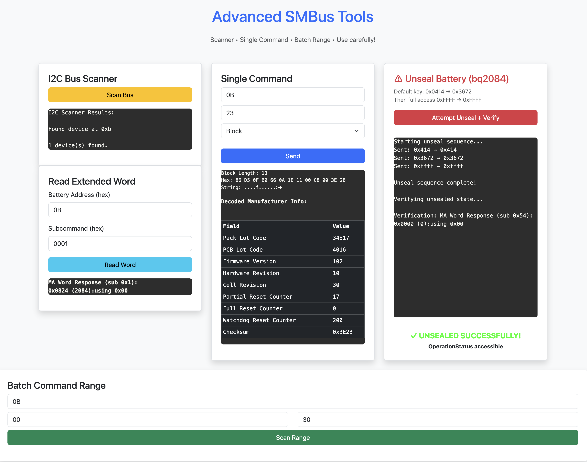

# ESP32 Smart Battery Monitor

A web-based monitor for SBS-compliant smart batteries (laptop packs) using ESP32. Reads pack voltage, current, temperature, SOC, capacity, health, runtime, manufacturer info, and more via SMBus/I2C.

Features:
- Responsive Bootstrap + Chart.js dashboard with gauge and cards
- Auto-refresh every 5 seconds
- JSON data logged to Serial (with timestamp)
- WiFi STA mode + fallback to Access Point if no connection
- Reliable I2C handling with bus recovery and delays (tested on BQ29312 packs)
- No bogus data display

## Hardware
- ESP32 dev board (e.g., NodeMCU-32S)
- Smart battery pack (e.g., your SMP TD06055 with BQ29312)
- 4.7kΩ pull-up resistors on SDA/SCL (recommended)
- Power ESP32 separately (USB or 5V) – do not power from battery SMBus lines!

### Simple Schematic

ESP32-WROOM (default I2C pins GPIO21,GPIO22)
------------------------------

Important Notes:
- ESP32 is 3.3V logic – do NOT connect to 5V!
- Power ESP32 separately (USB or external 5V to VIN) – do NOT use battery power pins for ESP32 power.
- 8-pin battery connectors vary! Common layout (viewed from battery contacts, pin 1 left):

Common Battery connector pins 
------------------------------

Connect:
--------

- ESP32 GPIO21 (SDA) → Battery SDA pin
- ESP32 GPIO22 (SCL) → Battery SCL pin
- ESP32 GND → Battery GND pin

**Safety first**: Test continuity, no shorts to power pins!

**Warning**: Identify pins carefully! Wrong connection can damage BMS. Use multimeter/scope.

## Setup

Use online flashing tool (in Google Chrome or Microsoft Edge):

https://mkosta74.github.io/esp32-smart-battery-monitor/

## Screenshots

## Notes
- ~~Individual cell voltages still not working (testing needed)~~ Working!
- Tested on: HSTNN-IB28, HSTNN-UB68, SS03XL
- Advanced page with some scaning tools
- unseal attempt, maybe...

Enjoy your portable smart battery reader!

