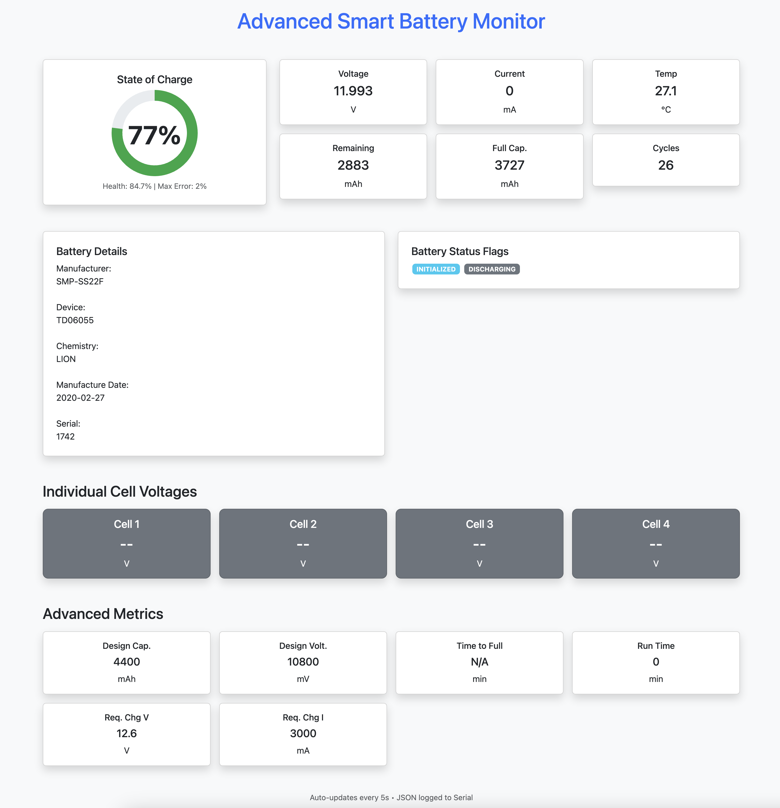

# ESP32 Smart Battery Monitor

A web-based monitor for SBS-compliant smart batteries (laptop packs) using ESP32. Reads pack voltage, current, temperature, SOC, capacity, health, runtime, manufacturer info, and more via SMBus/I2C.

Features:
- Responsive Bootstrap + Chart.js dashboard with gauge and cards
- Auto-refresh every 5 seconds
- JSON data logged to Serial (with timestamp)
- WiFi STA mode + fallback to Access Point if no connection
- Reliable I2C handling with bus recovery and delays (tested on BQ29312 packs)
- No bogus data display

## Hardware
- ESP32 dev board (e.g., NodeMCU-32S)
- Smart battery pack (e.g., your SMP TD06055 with BQ29312)
- 4.7kΩ pull-up resistors on SDA/SCL (recommended)
- Power ESP32 separately (USB or 5V) – do not power from battery SMBus lines!

### Simple Schematic

ESP32               Smart Battery Connector
GPIO21 (SDA) ----+---- SDA (Clock pin, usually pin 3-4 on 9-pin connector)
                 |
                4.7kΩ
                 |
                3.3VGPIO22 (SCL) ----+---- SCL (Data pin)
                 |
                4.7kΩ
                 |
                3.3VGND ---------------- GND (outer pins)+5V (VIN) --------- External power (do NOT connect to battery +)

Typical laptop battery pinout (9-pin):  
++ [gap] SCL SDA [unknown/Therm] GND GND  

**Warning**: Identify pins carefully! Wrong connection can damage BMS. Use multimeter/scope.

## Setup
1. Install libraries: ESPAsyncWebServer, AsyncTCP (latest from GitHub)
2. Edit WiFi credentials in code
3. Upload to ESP32
4. Open Serial Monitor for IP and JSON logs
5. Browse to IP for dashboard

If no WiFi: Connect to "BatteryMonitor" hotspot (pw: 12345678), open 192.168.4.1

## Screenshots

## Notes
- Individual cell voltages not supported on all packs (including BQ29312-based).
- Tested on SMP TD06055 pack.

Enjoy your portable smart battery reader!

